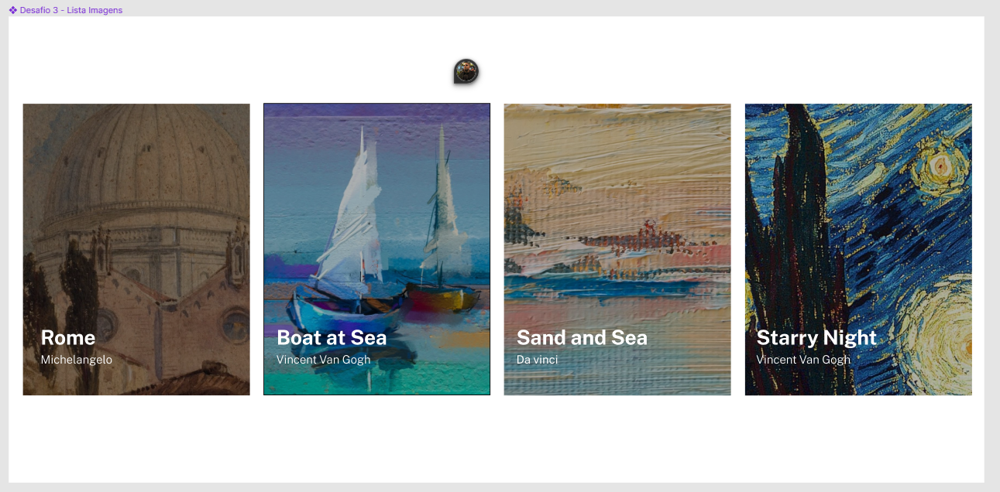
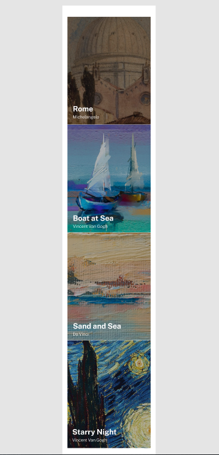
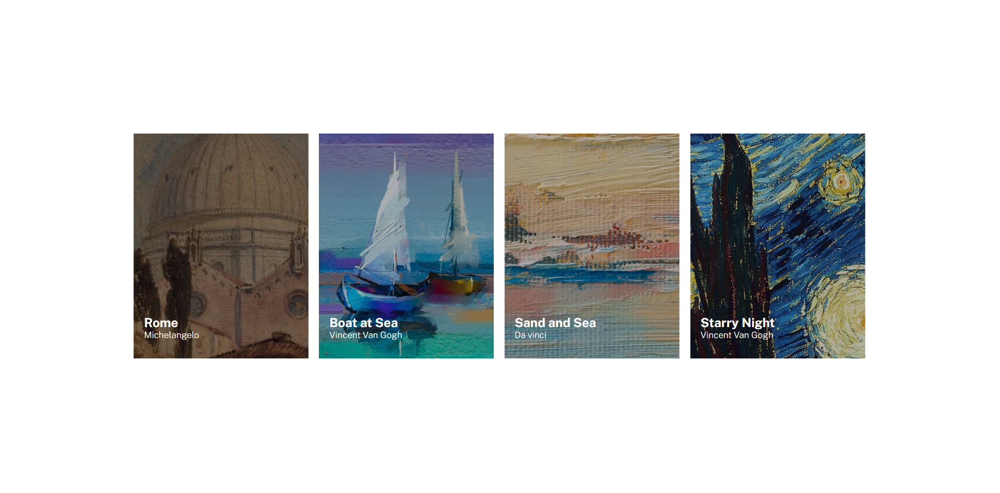
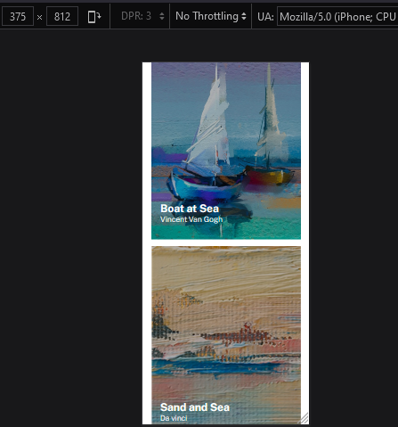

# Projeto Art Cards Images List
Um projeto para treinar Git Bash, HTML e CSS. Utilizando o flexbox, para reduzir a necessidade de configurações no responsivo. Ao desenvolver o projeto dessa maneira, facilita e simplifica a responsavidade do projeto.

## Descrição da tarefa
O principal desafio é criar um visual parecido com o disponibilizado no Figma. Contudo, iniciando primeiro o desenvolvimento voltado para o mobile. A tarefa ajuda a aprimorar as habilidades de posicionamento de elementos utilizando flexbox, assim como a implementação da resposividade.

### Font family para ser usada no projeto:

- Family: [Public Sans](https://fonts.google.com/specimen/Public+Sans?query=public)
- Weights: 400, 800

### Imagens do Design a ser seguido
[Figma](https://www.figma.com/file/DYk9DZr6urB9MZ4iNt1a61/Desafio-HTML-%2B-CSS?type=design&node-id=3-36&mode=design&t=y0Ez8lTDkyhH0Fzo-0)

  

## Imagens do Design criado

  

## Tecnologias utilizadas
- HTML
- CSS
- Git Bash

### Como utilizar

1 - Clone o projeto
***
git clone <https://github.com/cezarviana/art-cards-images-list.git>
***

